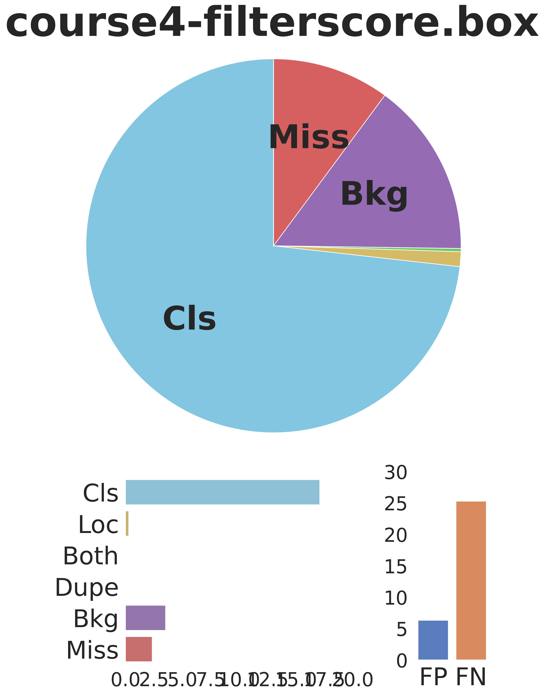

# 2D Rotation Detection TIDE

Source paper address https://arxiv.org/abs/2008.08115   
Source code address https://dbolya.github.io/tide/  

## Introduction
This code is modyfied by tide, which extends to the rotation object detection.

## Installation

Install some common dependency libraries, such as cv2
###Install DOTA_devkit
    sudo apt-get install swig  
    cd DOTA_devkit  
    swig -c++ -python polyiou.i  
    python setup.py build_ext --inplace

## Usage
this is for 2D object detection of COCO dataset   
1.python main.py    

this is for 2D rotation object detection of DOTA dataset
2.python main_rotate.py 

## visual

